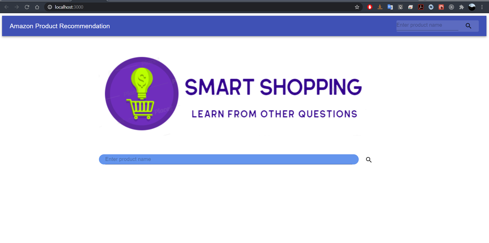
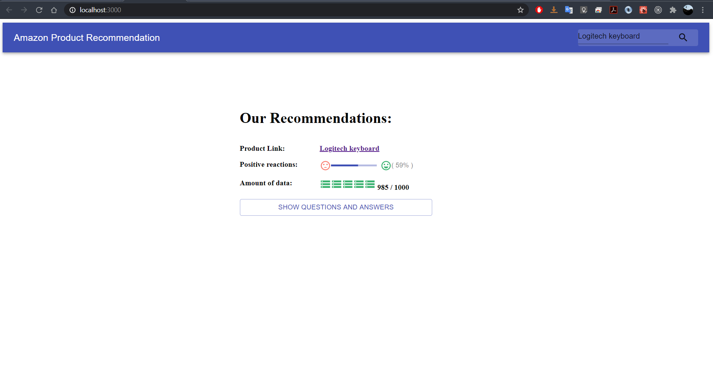
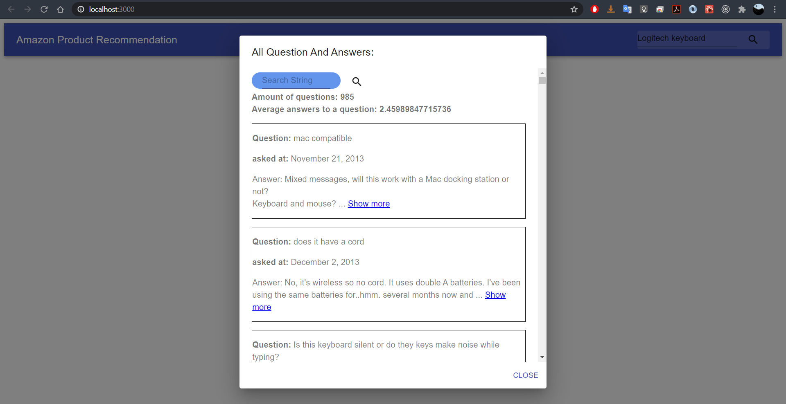
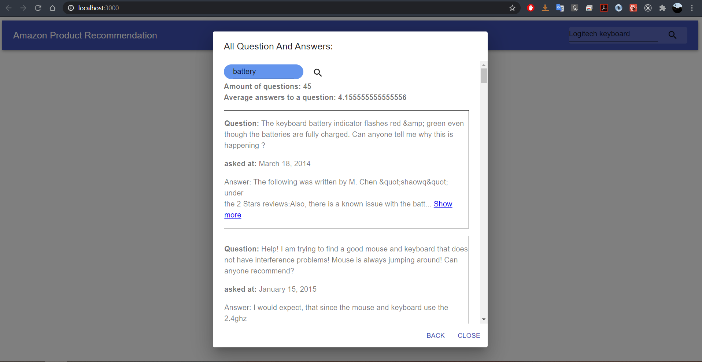

# Amazon Product Recommendation
The product is intended for consumers of the Amazon website who want to get an assessment of the quality of a product according to the Q&A section.

### Highlighted features
* Search for a product by name or by link to a product.
* View all existing product questions and answers.
* String search engine for all questions and answers.
* Obtaining a score that represents the positivity of the answers in the product.
* Get an indication of the amount of questions / data in relation to Amazon products.

## Architecture

## Quick Start:
1. run `git clone https://github.com/PerachBD/AmazonProductRecommendation.git`
2. run `npm i && npm start` both in the src folder and in the client folder

## Tecnolegis:
* Node
* React

### Main packages:
* Express: provides a robust set of features for web and mobile applications.
* axios: Promise based HTTP client for the browser and node.js.
* node-html-parser: HTML parser. Which will generate a simplified DOM tree, with basic element query support.
* p-limit: Run multiple promise-returning & async functions with limited concurrency.
* mocha: Simple, flexible, fun JavaScript test framework for Node.js.

### Snapshots:

